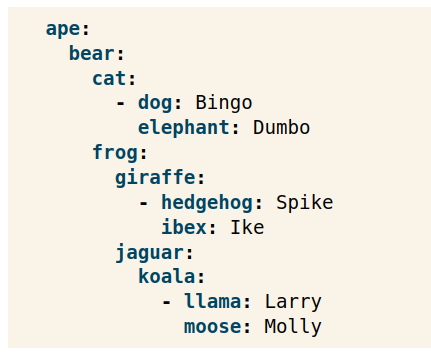
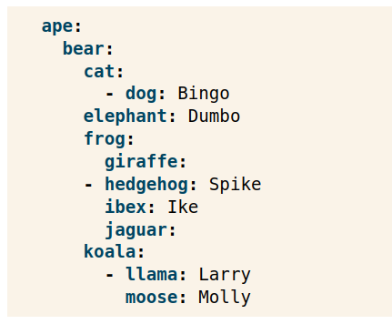

Without `sphinx_toolbox` enabled:



With `sphinx_toolbox` enabled:



Several properties have the wrong level of indentation. This doesn't happen if we use `literalinclude` to include the YAML data from a file.

reST source:

```rst
.. code-block:: yaml

    ape:
      bear:
        cat:
          - dog: Bingo
            elephant: Dumbo
        frog:
          giraffe:
            - hedgehog: Spike
              ibex: Ike
          jaguar:
            koala:
              - llama: Larry
                moose: Molly
```
